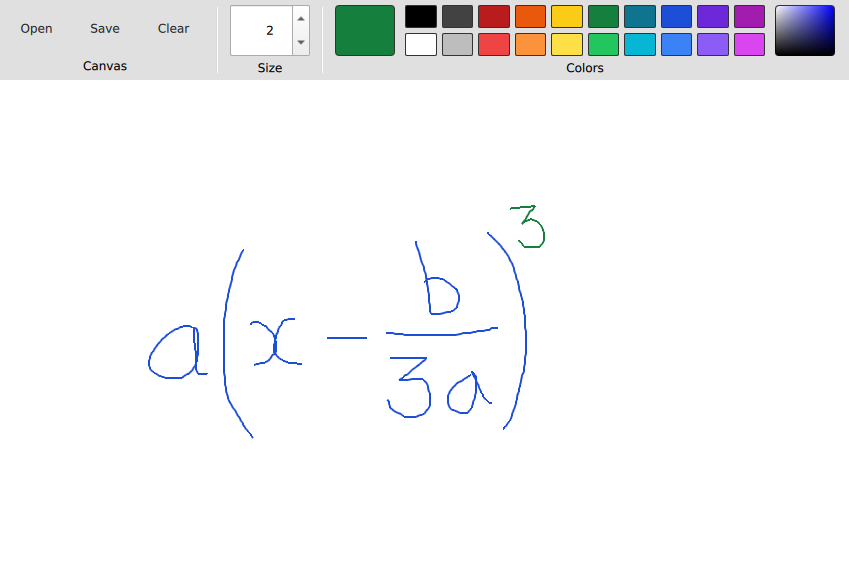

# OPEN WHITEBOARD



## About

The project is still a work in progress.

The goal is create a whiteboard and not taking application that provides the following functionalities:

* Ink to math using handwritten text recognition.
* Mouse and stylus input stabilization.
* Online streaming for group collaboration.

## Requirements

* Qt 6.2.1
* OpenCV 4
* tesseract 4.1.1
* leptonica-1.82.0

## Quick start

Change line `23` in `CMakeLists.txt` so that it points to your `OpenCVConfig.cmake`:

```cmake
set(OpenCV_DIR "/usr/lib/cmake/opencv4/OpenCVConfig.cmake")
```

You can find the location of your `OpenCVConfig.cmake` file by running the following command:

```bash
sudo find / -name "OpenCVConfig.cmake"
```
